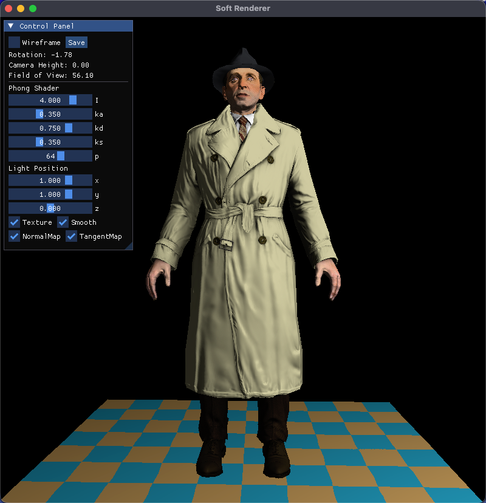

# 从零开始搭建软渲染器



## 依赖

- SFML (窗口显示， 需自行安装并替换 cmake 中的路径)
- IMGui/ImGui-SFML (UI 绘制, 头文件和源已包含)
- glm (数学库， 头文件已包含)
- stb_image (图片处理， 头文件已包含)
- tinyobjloader (模型加载， 头文件已包含)
- spdlog (日志库， 头文件已包含)

## 编译

平台 : MacOS 26.0, 其它平台需修改 CMakeLists

```bash
mkdir build
cd build
cmake ..
make
```

## 参考

https://github.com/ssloy/tinyrenderer

https://github.com/zauonlok/renderer

https://github.com/DrFlower/Hana-SoftwareRenderer